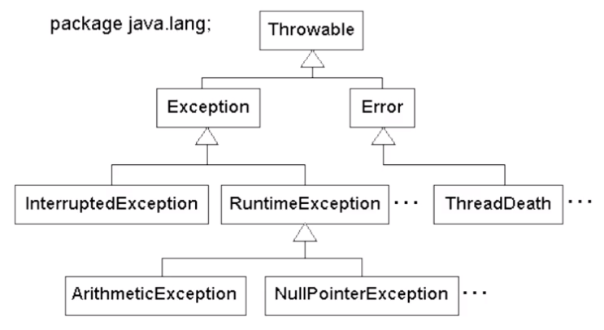

# Aprenda o funcionamento de Exceções em Java

## Exceptions

Exceções são todos os erros que ocorrem durante o processamento de um método que podem ser esperados ou não esperados. Como o termo já diz, “Exceptions” são exceções. Falhas que não devem ocorrer rotineiramente no fluxo de um sistema.

### Exemplo

```java
public static void metodo() {
	try {
		new java.io.FileInputStream("arquivo.txt");
	} catch (java.io.FileNotFoundException e) {
			System.out.println("Nao foi possível abrir o arquivo para leitura");
	}
}
```

